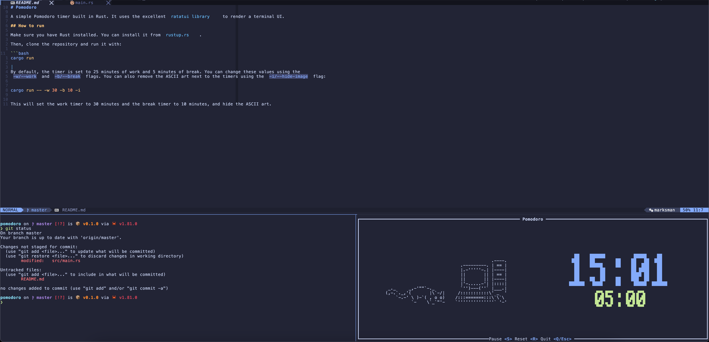

# Pomodoro

A simple Pomodoro timer built in Rust. It uses the excellent [ratatui library](https://ratatui.rs/) to render a terminal UI.
It works nicely in a terminal multiplexer:



## How to run

Make sure you have Rust installed. You can install it from [rustup.rs](https://rustup.rs/).

Then, get the binary from crates.io:

```bash
cargo install pomodoro-tui
```

You can now run the app with the following command:

```bash
pomodoro-tui
```

By default, the timer is set to 25 minutes for work sessions and 5 minutes for breaks. You can change these values using the
`-w/--work` and `-b/--break` flags. You can also remove the ASCII art next to the timers using the `-i/--hide-image` flag.
For instance, if you want to set the work timer to 30 minutes and the break timer to 10 minutes, and hide the ASCII art, you can run:

```bash
pomodoro-tui -w 30 -b 10 -i
```

## About notifications

If you're on MacOS, the app will notify you when the work or break time is over, by triggering both a notification and playing a sound (using the `say` command).
Don't be too surprised to hear a French accent!
On any other OS, the app won't notify or play a sound. Maybe I'll add this in the future.

## Acknowledgements

This small project to learn Rust has been inspired by my partner, who likes and encourages me to use the Pomodoro technique, even if she doesn't always enjoy breaks when it's time...

I also want to thank the authors of the ASCII art used in the app, which are combinations of works by _jgs_ and _Felix Lee_ you can find [here](https://www.asciiart.eu/computers/computers) and
[here](https://www.asciiart.eu/animals/cats).
